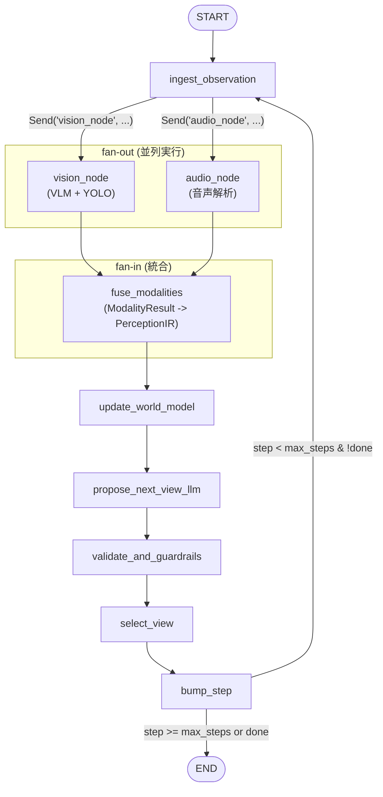

# アーキテクチャドキュメント

Safety View Agent の LangGraph fan-out/fan-in 並列マルチモーダルアーキテクチャ

## グラフ構造図



### fan-out/fan-in の仕組み

`ingest_observation` ノードは `Command` + `Send` API を使って複数のモダリティノードへ同時にデータを送信します。各モダリティノードの結果は `AgentState.modality_results` に `Annotated[List[ModalityResult], _add_list]` リデューサで蓄積され、全ノードの完了後に `fuse_modalities` で統合されます。

```python
# ingest_observation が返す Command
sends = [
    Send("vision_node", {"observation": obs}),
    Send("audio_node", {"observation": obs}),
]
return Command(update={...}, goto=sends)
```

LangGraph の `Send` は各ターゲットノードを**並列スレッド**で実行します。`vision_node` と `audio_node` の両方が `fuse_modalities` へエッジを持つため、両方が完了するまで `fuse_modalities` は実行されません（暗黙の fan-in バリア）。

## モダリティ責務分担表

| ノード | ファイル | 入力 | 出力 | 責務 |
|--------|----------|------|------|------|
| **vision_node** | `agent.py` | `Observation` | `ModalityResult(modality_name="vision")` | VLM 画像分析 + YOLO 物体検出 |
| **audio_node** | `agent.py` | `Observation` | `ModalityResult(modality_name="audio")` | 音声テキスト解析 → `AudioCue` リスト抽出 |
| **fuse_modalities** | `agent.py` | `List[ModalityResult]` | `PerceptionIR` | 全モダリティ結果を統合、`Perceiver.estimate()` でハザード推定 |

### モダリティ処理クラス（`modality_nodes.py`）

| クラス | 役割 | スレッドセーフ |
|--------|------|--------------|
| `VisionAnalyzer` | OpenAI互換 Vision API を呼び出して画像分析テキストを返す | httpx Client 内で完結 |
| `YOLODetector` | ultralytics YOLO モデルで物体検出 | `threading.Lock` で保護 |
| `AudioAnalyzer` | 音声テキストからヒューリスティックで `AudioCue` を抽出 | ステートレス（安全） |
| `ModalityResult` | 各モダリティノードの統一結果型（dataclass） | - |

### 統一結果型 `ModalityResult`

```python
@dataclass
class ModalityResult:
    modality_name: str                    # "vision" | "audio" | "lidar" etc.
    objects: list[DetectedObject] = []    # YOLO 検出結果
    audio_cues: list[AudioCue] = []       # 音声キュー
    description: Optional[str] = None     # VLM テキスト出力
    extra: dict[str, Any] = {}            # 将来の拡張用
    error: Optional[str] = None           # エラーメッセージ
```

## 並列化による利益

### 従来（逐次実行）

```
ingest → perceive_and_extract_ir → update_world_model → ...
              |
              ├── VLM API 呼び出し (60s)
              ├── YOLO 検出 (1s)
              └── 音声解析 (0.1s)
              合計: 61.1s
```

### 新方式（fan-out 並列実行）

```
ingest ─┬── vision_node ──┐
        │   ├── VLM (60s) │
        │   └── YOLO (1s) │── fuse_modalities → update_world_model → ...
        └── audio_node ───┘
            └── 音声 (0.1s)

合計: max(60s + 1s, 0.1s) = 61s
```

VLM I/O（HTTP リクエスト）と音声解析が並列実行されるため、モダリティ数が増えても最も遅いモダリティの実行時間がボトルネックになるだけで済みます。将来 LiDAR や深度センサーなどを追加しても、理論的な遅延は `max(各モダリティの処理時間)` に収まります。

## スレッドセーフティ

LangGraph の `Send` は各ノードを別スレッドで並列実行するため、共有リソースへのアクセスにはスレッドセーフティが必要です。

### YOLODetector の Lock 設計

```python
class YOLODetector:
    def __init__(self, model_path: str = "yolov8n.pt") -> None:
        self._model = YOLO(model_path)
        self._lock = threading.Lock()  # ultralytics はスレッドセーフでない

    def detect(self, image_path: str) -> list[DetectedObject]:
        with self._lock:  # 排他制御
            res = self._model(image_path, verbose=False)[0]
        # Lock 外で後処理（並列性を維持）
        ...
```

ultralytics の YOLO モデルは内部状態を持つためスレッドセーフではありません。`threading.Lock` で推論部分のみを排他制御し、後処理は Lock 外で実行することで並列性を維持しています。

### 各コンポーネントのスレッドセーフティ

| コンポーネント | 方式 | 理由 |
|--------------|------|------|
| `VisionAnalyzer` | 安全（Lock 不要） | 各呼び出しで新しい `httpx.Client` を生成 |
| `YOLODetector` | `threading.Lock` | ultralytics モデルが非スレッドセーフ |
| `AudioAnalyzer` | 安全（Lock 不要） | ステートレスなヒューリスティック処理 |
| `AgentState.modality_results` | `Annotated[List, _add_list]` | LangGraph のリデューサが排他管理 |

## ファイル構成

```
src/safety_agent/
├── schema.py            # Pydantic モデル定義
│   ├── BoundingBox, DetectedObject, AudioCue
│   ├── Hazard, UnobservedRegion, CameraPose
│   ├── PerceptionIR     # modality_errors フィールド含む
│   ├── WorldModel, ViewCandidate, NextViewPlan, ViewCommand
│   └── Observation, ObservationProvider
│
├── modality_nodes.py    # モダリティ処理クラス (NEW)
│   ├── ModalityResult   # 統一結果型
│   ├── VisionAnalyzer   # VLM 画像分析
│   ├── YOLODetector     # YOLO 物体検出（Lock付き）
│   └── AudioAnalyzer    # 音声解析
│
├── perceiver.py         # ハザード推定専門エンジン (REFACTORED)
│   └── Perceiver
│       ├── estimate()          # fuse_modalities から呼ばれる
│       ├── _infer_hazards()    # 検出結果 → ハザード推定
│       ├── _infer_unobserved() # 未確認領域推定
│       └── run()               # 後方互換ラッパー
│
└── agent.py             # LangGraph グラフ + ノード
    ├── OpenAICompatLLM          # LLM クライアント
    ├── AgentState               # modality_results 含む
    ├── ContextSchema            # vision_analyzer, yolo_detector, audio_analyzer 含む
    ├── ingest_observation()     # fan-out (Command + Send)
    ├── vision_node()            # VLM + YOLO
    ├── audio_node()             # 音声解析
    ├── fuse_modalities()        # fan-in (ModalityResult → PerceptionIR)
    ├── update_world_model()     # 世界モデル更新
    ├── propose_next_view_llm()  # LLM 計画 or ヒューリスティック
    ├── validate_and_guardrails()# ガードレール
    ├── select_view()            # 最適ビュー選択
    ├── bump_step()              # ステップカウント
    └── build_agent()            # グラフ構築
```

## AgentState（状態管理）

```python
class AgentState(TypedDict):
    messages: Annotated[List[Dict[str, str]], add_messages]
    step: int
    max_steps: int
    observation: Optional[Observation]
    ir: Optional[PerceptionIR]
    modality_results: Annotated[List[ModalityResult], _add_list]  # fan-in バッファ
    world: WorldModel
    plan: Optional[NextViewPlan]
    selected: Optional[ViewCommand]
    done: bool
    errors: Annotated[List[str], _add_list]
```

`modality_results` は `_add_list` リデューサによってリスト結合されます。各モダリティノードが `{"modality_results": [result]}` を返すと、自動的にリストに追加されます。`ingest_observation` の冒頭で `[]` にリセットし、次の fan-out サイクルに備えます。

## ContextSchema（ランタイムコンテキスト）

```python
class ContextSchema(TypedDict):
    provider: ObservationProvider
    perceiver: Perceiver
    llm: Optional[OpenAICompatLLM]
    vision_analyzer: Optional[VisionAnalyzer]   # NEW
    yolo_detector: Optional[YOLODetector]        # NEW
    audio_analyzer: AudioAnalyzer                # NEW
    risk_stop_threshold: float
    hazard_focus_threshold: float
```

## LLM フォールバック設計

```
propose_next_view_llm()
  ├── llm が None → _heuristic_plan() で即フォールバック
  └── llm が有効
       ├── chat_json() 成功 → NextViewPlan を生成
       └── chat_json() 失敗 → _heuristic_plan() + errors に記録
```

ヒューリスティック計画は `WorldModel.outstanding_unobserved` をリスク順にソートし、最高リスクの未確認領域を次のビュー候補として提案します。

## 拡張ポイント

新しいセンサー（例：LiDAR、深度カメラ）を追加する手順は最小限です。

1. `modality_nodes.py` に新しいアナライザークラスを追加
2. `agent.py` に新しいノード関数を追加
3. `ingest_observation` の `sends` リストに `Send("new_node", ...)` を追加
4. `build_agent()` に `add_node` と `add_edge("new_node", "fuse_modalities")` を追加
5. `fuse_modalities` で新モダリティの結果を処理

詳細な手順とコード例は [EXTENDING.md](EXTENDING.md) を参照してください。

## 依存関係の方向

```
run.py
  ↓
agent.py ─── modality_nodes.py
  ↓              ↓
perceiver.py ←──┘
  ↓
schema.py
```

- `modality_nodes.py` は `schema.py` のみに依存（`agent.py` への逆依存なし）
- `perceiver.py` は `schema.py` のみに依存（VLM/音声処理は `modality_nodes.py` に移管済み）
- `agent.py` が全モジュールをオーケストレーション
